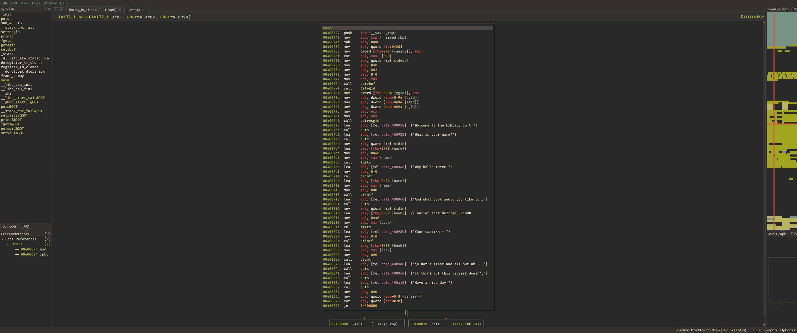
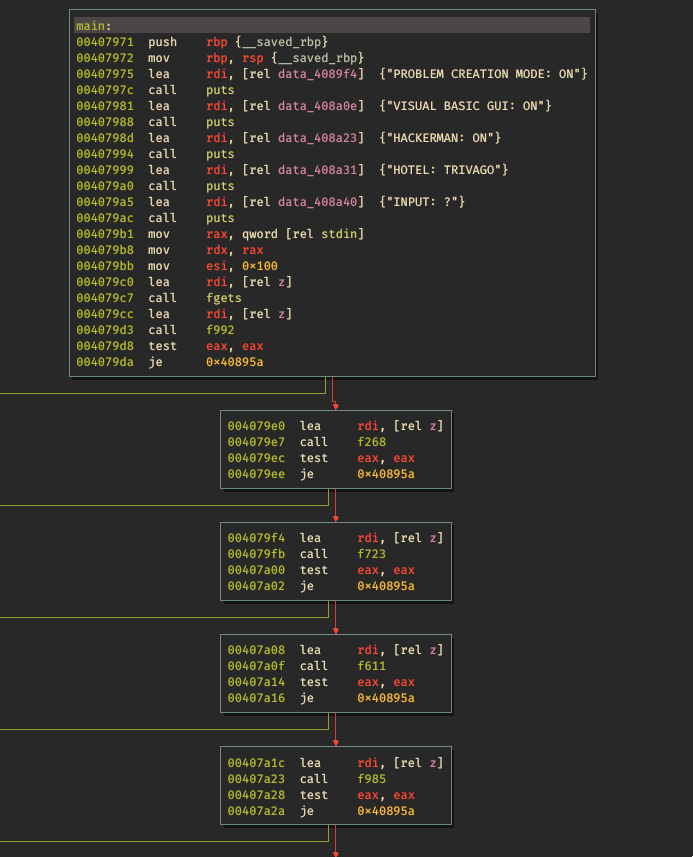

# binaryninja-themes

# Installation

Copy the .bntheme file you want into `~/.binaryninja/themes` (You may have to create this directory) and select the desired theme under Edit > Settings > Theme.

# Gruvbox

Based on the popular [gruvbox](https://github.com/morhetz/gruvbox) colorscheme and derived from [35c3](https://github.com/Vector35/community-themes/blob/master/35c3.bntheme).

